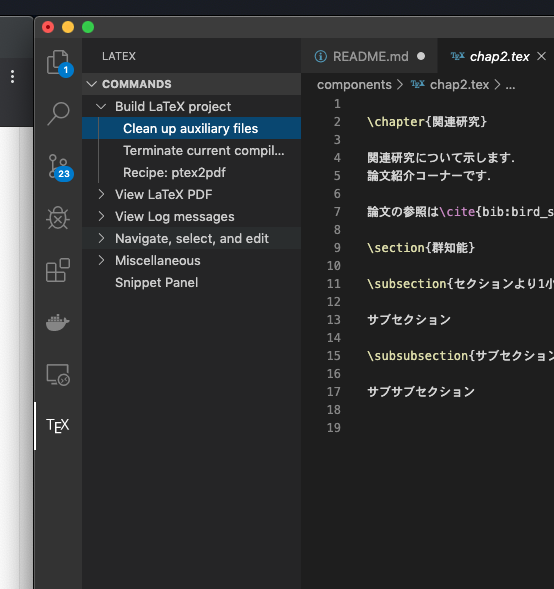
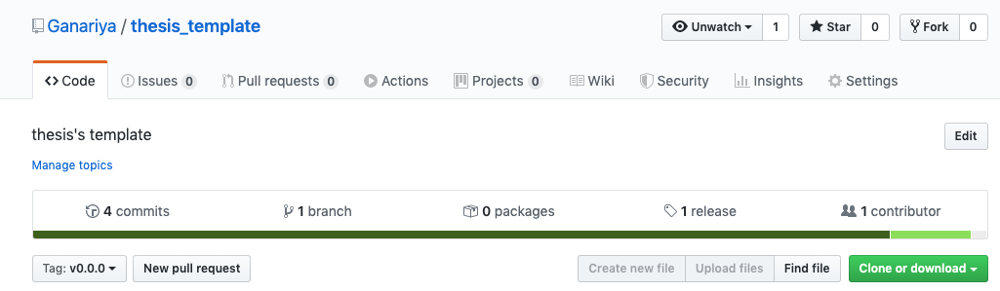

# タイトル

thesis_template

# Init

このリポジトリをGitHubの右上からForkしてください．

Forkすると，自分のアカウントにthesis_templateが追加されます．

フォークされた自分のアカウントのthesis_templateに，卒論を書いていきます．

# How to Use(Command)

thesis_templateフォルダで

```
fish compile.fish
```

もしくは

```
./compile.sh
```

としてください．

これによって，LaTeXがコンパイルされてPDFが生成されます．

ただし，Dockerが起動されている必要があるため，Dockerをインストールしていない場合はインストールしてください．
また起動していない場合は，起動させてから上記の`fish compile.fish`などを利用してください．

# How to Use(Visual Studio Code)

[Mac OS X(Mojave)にLaTeX環境を構築する[VSCode版]](https://murabitoleg.com/mac-vscode-latex/)
を参考にVisual Studio Codeで保存時にコンパイル＋PDFの生成が行えます．


ただし，LaTeX的に不備な記述（文法エラー）がある場合永遠に実行しようとしてなにもPDFが進まないため
「Build Latex Project」から「Clean up auxi...」と「Terminate current com...」を行い
文法エラーを直してから，再びCommand + Sや，Recipe: ptex2pdfを行ってください．




# タグデプロイ時のコンパイル+PDF生成

このリポジトリは

[GitHub Actions で TeX をコンパイル・PDF 化してタグ付きリリースする話](https://qiita.com/denkiuo604/items/137a1b3fc1955cfb9c58)を参考にさせていただき

タグ付きでプッシュしたとき，PDFをコンパイルしてGithubのAssetにPDFを追加するようになっています．
バックアップをこまめに行うことが可能です．

v0.0.0やv1.0.0のような形式でタグ付けを行いプッシュすると良いです．

のreleaseにPDFが生成されます．

もしデプロイ時にGitHub Actionsでエラーが出る場合は
`.github > workflows > main.yml`のmain.ymlを
`Ganariya`からあなたのGitHubのアカウント名にしてあげてください．改善される可能性があります．

```yml
name: LaTeX to PDF

on:
  push:
    paths: main.tex
    tags: v*.*.*

jobs:
  build:
    name: Build
    runs-on: ubuntu-latest
    steps:
      - name: Set up Git repository
        uses: actions/checkout@v1
      - name: Build docker image
        uses: あなたのGitHubのアカウント名/thesis_template/.github/actions/latex@master
        env:
          GITHUB_TOKEN: ${{ secrets.GITHUB_TOKEN }}
```